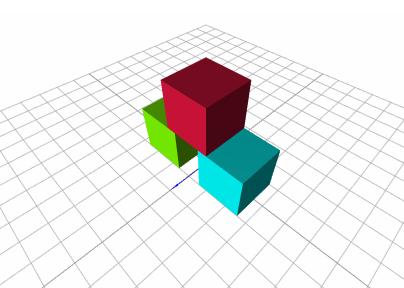

react-threejs-sample
================

Sample project using React and [ThreeJS](https://www.npmjs.com/package/three).<br>
The React project was initially created using [Next.JS](https://nextjs.org/).


## Description
This project is more of an exercise in coding.<br>
I wanted to make my own React bindings for Three.JS that will treat objects
as components that can be viewed in the debugger.<br>
Also the possibility or limitations of making the objects totally dynamic (can change the props), in React way (using states).


## Usage
=====

An example on how to use:

```js
<ThreeContainer options={{ grid: true }}>
    <ThreeObject type="cube" position={{ x: 8, y: 0, z: 0 }} color={'aqua'} />
    <ThreeObject type="cube" position={{ x: 0, y: 10, z: 0 }} color={'crimson'} />
    <ThreeObject type="cube" position={{ x: -8, y: 0, z: 0 }} color={'chartreuse'} />
</ThreeContainer>
```



To update the objects, you will need to update the state.<br>
However, I also made a /test page where you can update the objects without updating the props but this is not the React way of doing things. 


## Installation
Clone repository and run

```
npm install
```


## Run
Runs the app in the development mode

```
npm run dev
```

Open [http://localhost:3000](http://localhost:3000) to view it in the browser.

The page will reload if you make edits.<br>
You will also see any lint errors in the console.


## Todo
Make custom element instead of using DIV.
